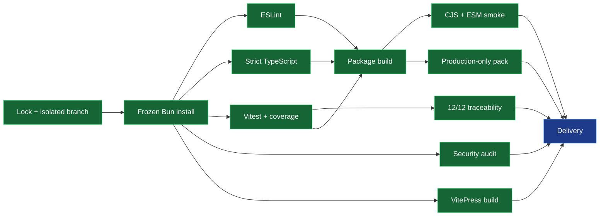

# A+ Quality Loop — 2026-07-18

## Cockpit

| Control | State | Exact evidence |
|---|---|---|
| Repository | GREEN | `KooshaPari/Conft`, writable (`ADMIN`), non-archived |
| Isolation | GREEN | `chore/aplus-quality-loop-20260718`, based on `origin/main` at `afe5493` |
| Deterministic install | GREEN | `bun install --frozen-lockfile`: 446 installs / 518 packages, 0 changes |
| Lint | GREEN | ESLint: 1/1 command passed |
| Type safety | GREEN | strict TypeScript: 1/1 command passed |
| Tests | GREEN | Vitest: 53/53 tests passed across 6/6 files |
| Coverage | GREEN | 93.78% statements, 95.77% branches, 86.27% functions, 94.47% lines |
| Requirement traceability | GREEN | 12/12 requirements explicitly mapped (100%) |
| Security | GREEN | Bun audit: 0 critical/high findings |
| Package build | GREEN | CJS + ESM + two declaration outputs built |
| Package smoke | GREEN | CJS and ESM exports plus adapter contract passed |
| Package contents | GREEN | dry-run: 13 production files, 87.1 KB unpacked, no tests |
| Documentation build | GREEN | VitePress client/server bundle and page rendering passed |

## Progress Bars

- Claimed local gates: `██████████` 10/10
- Test pass rate: `██████████` 53/53 = 100%
- Requirement traceability: `██████████` 12/12 = 100% (target >=85%)
- Statement coverage: `█████████░` 166/177 = 93.78%
- Branch coverage: `██████████` 68/71 = 95.77%
- Function coverage: `█████████░` 44/51 = 86.27%
- Line coverage: `█████████░` 154/163 = 94.47%

Baseline deltas:

| Gate | Baseline | Final |
|---|---:|---:|
| Frozen install | 0/1 | 1/1 |
| Tests | 50/50 | 53/53 |
| Requirement traceability | not explicitly defined | 12/12 |
| Critical/high dependency findings | 3 (1 critical, 2 high) | 0 |
| Package test files shipped | 6 | 0 |
| Build formats | 2/2 | 2/2 |
| Documentation build | 1/1 | 1/1 |

## DAG

## WBS

1. Eligibility: prove clean source checkout, remote writability, lock ownership, and branch isolation.
2. Baseline: measure frozen install, lint, types, tests, coverage, builds, audit, and package behavior.
3. Supply chain: update vulnerable Vitest/Vite/Lodash paths and regenerate only `bun.lock`.
4. Traceability: map all 12 functional requirements to executable or explicit gap evidence.
5. Packaging: build both module formats, smoke their exports, and exclude tests from the tarball.
6. CI: replace mutable global Bun installation with pinned setup and frozen installs.
7. Delivery: rerun every claimed gate, commit, push without force, and open a PR.

## Verification Spec

The lane is locally green only when all ten controls pass: frozen install, lint, typecheck,
tests, coverage floors, traceability, package build, package smoke, dry-run packaging,
documentation build, and high-severity audit. Traceability is calculated as requirements with
an explicit evidence or gap record divided by all IDs in `FUNCTIONAL_REQUIREMENTS.md`:
12 / 12 = 100%. It is deliberately distinct from implementation satisfaction.

## ADR

**ADR-QL-001: Keep Bun as the deterministic package path.** Accepted. The repository already
commits `bun.lock`; CI now installs Bun from an immutable action revision and uses frozen installs.

**ADR-QL-002: Upgrade security-sensitive test tooling without broad modernization.** Accepted.
Vitest and its coverage provider move together to 4.1.10, Vite is constrained to patched 6.4.3,
and Lodash ES to patched 4.18.1. Unrelated dependencies remain untouched.

**ADR-QL-003: Treat traceability and satisfaction as separate metrics.** Accepted. Every FR has
evidence, but partial and missing capabilities remain explicit rather than being converted into
passing behavioral claims.

**ADR-QL-004: Validate the published shape, not only source tests.** Accepted. CJS, ESM,
declarations, runtime exports, and dry-run package contents are deterministic gates.

## Risk-Control Register

| Risk | Control | Verification |
|---|---|---|
| Lockfile drift | Frozen Bun install | 446 installs / 518 packages, 0 changes |
| Vulnerable development tooling | Patched direct dependencies and overrides | 3 findings reduced to 0 |
| Type regressions | Strict TypeScript | 1/1 pass |
| Behavior regressions | Vitest with enforced floors | 53/53; all four metrics >86% |
| Requirement orphaning | Executable exact-set trace test | 12/12 mapped |
| Misstated completeness | Verified/partial/gap statuses | 7 verified, 3 partial, 2 gaps |
| Broken package entry points | CJS + ESM runtime smoke | 2/2 formats pass |
| Shipping test internals | Negative package file rule | 13 files, 0 test files |
| Documentation regression | Deterministic VitePress build | 1/1 pass; large-chunk warning remains |
| CI billing restrictions | Preserve local evidence and open PR only after local gates | No merge or release attempted |

## Traceability Matrix

| Requirement | Status | Evidence |
|---|---|---|
| FR-SCHEMA-001 | Partial | `src/domain/config.ts` |
| FR-SCHEMA-002 | Partial | `src/index.test.ts` |
| FR-SCHEMA-003 | Verified | `src/domain/config.ts` + strict typecheck |
| FR-SRC-001 | Partial | `src/adapters/file-adapter.test.ts` |
| FR-SRC-002 | Verified | `src/adapters/env-adapter.test.ts` |
| FR-SRC-003 | Verified | `src/services/config-manager.test.ts` |
| FR-LAYER-001 | Verified | `src/services/config-manager.test.ts` |
| FR-LAYER-002 | Gap | `adr/ADR-003-deep-merge.md` |
| FR-LAYER-003 | Gap | `src/domain/secret.test.ts` |
| FR-HEX-001 | Verified | `src/ports/config-source.ts` |
| FR-HEX-002 | Verified | `src/services/config-manager.ts` |
| FR-HEX-003 | Verified | `src/adapters/file-adapter.ts` |
| **Total** | **7 verified / 3 partial / 2 gaps** | **12/12 traced (100%)** |
